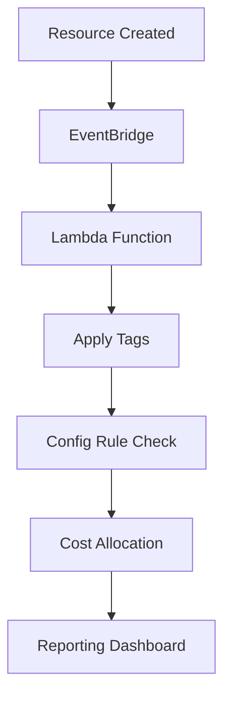

# Introduction to Resource Tagging Automation

## What is Resource Tagging?

Resource tagging is a method of applying metadata to AWS resources in the form of key-value pairs. Tags enable you to:

- **Organize Resources**: Group resources by project, environment, or team
- **Track Costs**: Allocate spending to specific departments or projects  
- **Automate Operations**: Enable automated resource management
- **Ensure Compliance**: Meet organizational and regulatory requirements

## Why Automate Tagging?

Manual tagging is error-prone and time-consuming. Automated tagging ensures:

- **Consistency**: All resources follow the same tagging standards
- **Compliance**: Resources are tagged according to policies
- **Cost Control**: Accurate cost allocation from day one
- **Operational Efficiency**: Reduced manual overhead

## Workshop Architecture Overview

## Key Components

### 1. Event-Driven Tagging
- **EventBridge Rules** capture resource creation events
- **Lambda Functions** apply appropriate tags automatically

### 2. Compliance Monitoring  
- **AWS Config Rules** ensure tag compliance
- **Automated Remediation** fixes non-compliant resources

### 3. Cost Allocation
- **Cost Explorer** provides detailed cost breakdowns
- **Billing Alerts** notify of cost anomalies

### 4. Governance Integration
- **Service Catalog** enforces tagging standards
- **Organizations Policies** prevent untagged resources

Let's get started with the preparation steps!